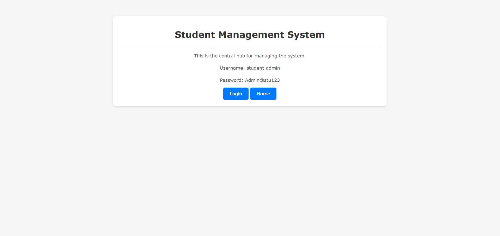
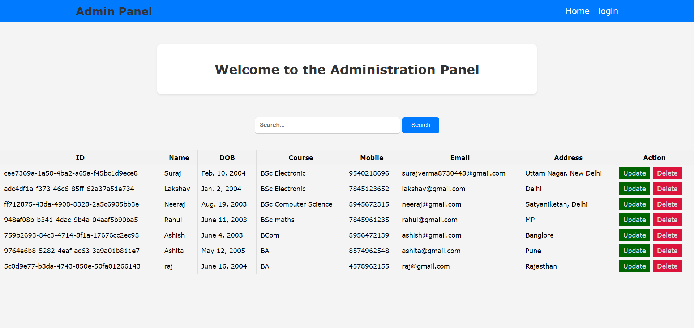
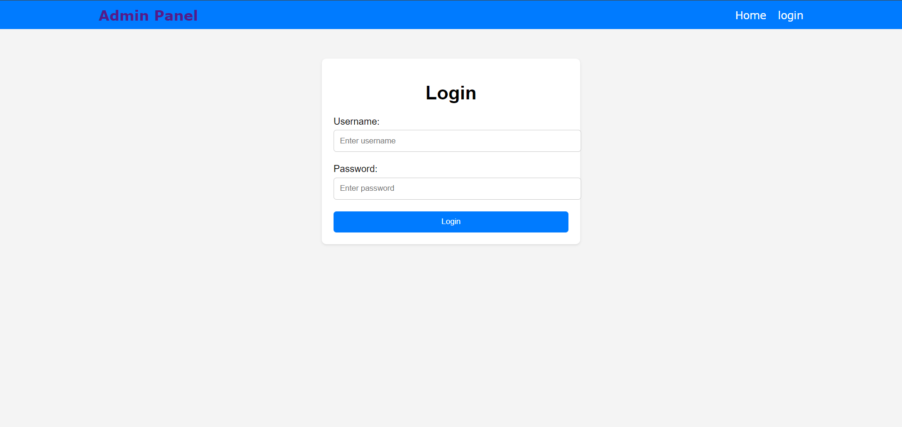

# Student management System using Admin

<h2>Project Description:</h2>
The Basic Student Management System is a Django web application designed for beginners as their first Django project. This project aims to provide a hands-on experience for individuals with basic knowledge of Django, allowing them to implement fundamental concepts while building a functional student management system.

<h2>Features:</h2>
<b>User Authentication:</b>
Implement user authentication using Django's built-in authentication system, allowing users to register, log in, and log out securely.

<b>Student CRUD Operations:</b>
Create, Read, Update, and Delete (CRUD) operations for managing student records. Users should be able to add new employees, view existing student details, update student information, and delete student records when necessary.

<b>StudentListing:</b>
Display a list of all employees with basic information such as name, designation, department, and contact details. Implement pagination for better usability if the number of students is large.

<b>Search Functionality:</b>
Implement a search feature to allow users to search for specific student by their name, department, or any other relevant criteria.

<b>User Interface:</b>
Design a simple and intuitive user interface using HTML, CSS, and Bootstrap . Focus on usability and responsiveness to ensure the application looks good.

<h2>Project Images</h2>

 
 
 

By working on this project, you will gain hands-on experience with Django fundamentals such as models, views, templates, forms, authentication, and database interactions. 
